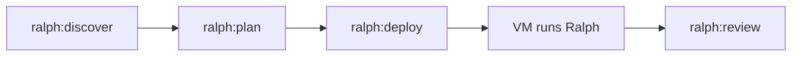

# 🔥 Ralph Inferno

```
🔥🔥🔥🔥🔥🔥🔥🔥🔥🔥🔥🔥🔥🔥🔥🔥🔥🔥🔥🔥🔥🔥🔥🔥🔥
🔥                                              🔥
🔥  ██████╗  █████╗ ██╗     ██████╗ ██╗  ██╗    🔥
🔥  ██╔══██╗██╔══██╗██║     ██╔══██╗██║  ██║    🔥
🔥  ██████╔╝███████║██║     ██████╔╝███████║    🔥
🔥  ██╔══██╗██╔══██║██║     ██╔═══╝ ██╔══██║    🔥
🔥  ██║  ██║██║  ██║███████╗██║     ██║  ██║    🔥
🔥  ╚═╝  ╚═╝╚═╝  ╚═╝╚══════╝╚═╝     ╚═╝  ╚═╝    🔥
🔥                                              🔥
🔥          I N F E R N O   M O D E             🔥
🔥                                              🔥
🔥  Build while you sleep. Wake to working code 🔥
🔥                   🌙 → ☀️                     🔥
🔥                                              🔥
🔥🔥🔥🔥🔥🔥🔥🔥🔥🔥🔥🔥🔥🔥🔥🔥🔥🔥🔥🔥🔥🔥🔥🔥🔥
```

AI-driven autonomous development workflow.

## Requirements

**Local machine:**
- Node.js (for npx)
- [Claude Code CLI](https://docs.anthropic.com/en/docs/claude-code) (`claude`)
- GitHub CLI (`gh`) - optional, for auto-detecting username

**VM (where Ralph runs):**
- A running VM/server (Hetzner, GCP, DigitalOcean, AWS, or your own)
- SSH access to the VM
- Git installed
- Claude Code CLI with API key configured

**Optional:**
- Cloud CLI (`hcloud`, `gcloud`, `doctl`, `aws`) for VM management
- [ntfy.sh](https://ntfy.sh) for notifications

## Installation

```bash
npx ralph-inferno install
```

This will:
1. Show disclaimer (VM sandbox required)
2. Ask for your preferences (language, cloud provider, etc.)
3. Install Ralph core files to `.ralph/`
4. Create a `ralph` wrapper script

## Update

Update core files while preserving your config:

```bash
npx ralph-inferno update
```

## Workflow



### Commands

| Command | Description |
|---------|-------------|
| `/ralph:discover` | Interactive requirements gathering, creates PRD |
| `/ralph:plan` | Creates implementation plan + spec files |
| `/ralph:deploy` | Push to GitHub, start Ralph on VM |
| `/ralph:review` | Check if done, pull results, open tunnels |

### Example Session

```bash
# 1. Install Ralph in your project
npx ralph-inferno install

# 2. In Claude Code:
/ralph:discover    # Answer questions about your project
/ralph:plan        # Generate implementation plan
/ralph:deploy      # Send to VM and let Ralph build

# 3. Next morning:
/ralph:review      # See what Ralph built
```

## Safety

Ralph runs AI-generated code autonomously. For safety:

- **ALWAYS run on a disposable VM** - never on your local machine
- Review generated code before production
- Never store credentials in code

## Cloud Providers

Ralph supports multiple cloud providers for VM execution:

| Provider | CLI | Notes |
|----------|-----|-------|
| Hetzner | `hcloud` | Cheapest, great for Europe |
| Google Cloud | `gcloud` | Good free tier |
| DigitalOcean | `doctl` | Simple and reliable |
| AWS | `aws` | Enterprise option |
| SSH | - | Use your own server |

## Config File

Configuration is stored in `.ralph/config.json`:

```json
{
  "version": "1.0.0",
  "language": "en",
  "provider": "hcloud",
  "vm_name": "ralph-sandbox",
  "region": "fsn1",
  "github": {
    "username": "your-username"
  }
}
```

## Documentation

- [Architecture](docs/ARCHITECTURE.md) - System overview and memory model
- [CLI Flags](docs/CLI-FLAGS.md) - All ralph.sh options
- [Token Optimization](docs/TOKEN-OPTIMIZATION.md) - Cost-saving strategies

## Credits & Inspiration

Ralph Inferno builds on ideas from:

- [snarktank/ralph](https://github.com/snarktank/ralph) - Ryan Carson's original Ralph concept
- [how-to-build-a-coding-agent](https://github.com/ghuntley/how-to-build-a-coding-agent) - Geoffrey Huntley's agent patterns
- [claude-ralph](https://github.com/RobinOppenstam/claude-ralph) - Robin Oppenstam's implementation

## License

MIT
